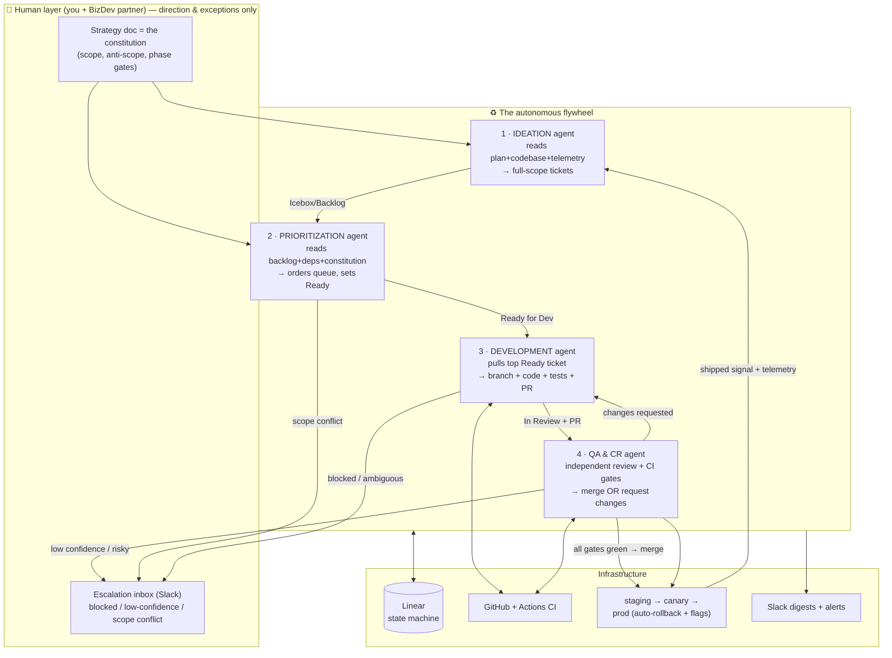

# The Autonomous Development Flywheel

*Self-running Ideation → Prioritization → Development → QA/CR loop for Concierge*
*Prepared for Omer · Draft v1 · July 2026 · builds directly on the Cashflow autonomous playbook*

---

## 0. Read first — what "100% autonomous" actually means here

You already built the hard 80% of this for Cashflow: a safety floor (tests + CI + branch protection), two-way Linear↔GitHub sync, agent-ready tickets, an execution routine, and a daily scan routine. In that system you kept **two human gates**: **scope** (you promote a ticket to Todo) and **merge** (you review and merge the PR). This project is about **closing those two gates** so the loop runs without you.

That is doable. But closing a human gate is not the same as deleting it — it means **replacing a human decision with a machine gate strong enough to trust in your place.** Your own hard-won lessons make this precise:

- *"Review is the bottleneck, not the agent."* → To remove yourself from review, you need an **independent reviewer agent** plus hard CI gates that are genuinely good — not a rubber stamp.
- *"CI green ≠ right tests."* → An autonomous merge can't trust a green check alone. It needs coverage thresholds, an adversarial reviewer, and a deploy-safety net.
- *"Routines run with no per-step approval — so the guardrails, not a watching human, keep it safe."* → With both gates closed, the **guardrails ARE the product.** Build them first.

So the design principle for this doc:

> **Every human gate you remove must be replaced by (a) an automated gate at least as strict, and (b) a way to undo the mistake the gate would have caught.** Because nothing human now stands between an agent and production, the deploy path itself must be reversible (staging → canary → auto-rollback → feature flags).

And one more, non-negotiable: **you do not go 0→100% autonomous on day one.** You run the loop in shadow, then supervised, measure the agents' decisions against what you'd have done, and remove each gate only once it's earned trust (§7). "Fully autonomous" is the destination, not the launch config.

**Where your judgment goes when the gates close:** into the **strategy doc** (`iPlan-Competitor-Strategy.md`, §14 builder brief + §15 anti-scope). That file stops being a plan and becomes the **constitution the loop obeys** — the encoded version of the "is this in scope?" decision you used to make by hand.

---

## 1. The flywheel — system architecture

Four agents, orbiting **Linear as the single source of truth**. Each Linear issue *status* is a state in a pipeline; agents are triggered by state transitions and by cron. GitHub holds code, GitHub Actions runs CI, Slack is the observability plane, Claude Code Routines are the runtime.



**Why it's a flywheel and not just a pipeline:** the last stage feeds the first. Every merge + the production telemetry it generates becomes input to the next Ideation cycle. Shipped code → usage data → new ideas → new tickets. The loop compounds.

---

## 2. Linear = the state machine (the backbone)

Reuse your Cashflow conventions exactly (states must match `list_issue_statuses` for the team; labels must pre-exist or they fail silently; priority ints 1=Urgent…4=Low; `save_issue` takes team name to create or issue ID to update).

**Workflow states (each = a pipeline stage the agents key off):**

| State | Meaning | Who moves it in | Who moves it out |
|---|---|---|---|
| `Icebox` | Raw ideas, not yet scoped | Ideation | Prioritization |
| `Backlog` | Fully-scoped, agent-ready, awaiting priority | Ideation | Prioritization |
| `Ready for Dev` | Top of queue, deps clear, in-scope | **Prioritization (= old scope gate)** | Development |
| `In Progress` | Agent building | Development | Development |
| `In Review` | PR open, being evaluated | Development (PR event) | QA/CR |
| `Changes Requested` | Reviewer bounced it | QA/CR | Development |
| `Done` | Merged + deployed | **QA/CR (= old merge gate)** | — |
| `Blocked / Needs Human` | Escalated | any agent | Human |

**Machine-readable flags (extend your `🔒` convention):**
- `🔒 needs-human` — hard stop; no agent proceeds (migrations, auth, payments, anything touching real money/PII).
- `⚠️ sensitive` — allowed, but forces the *strict* QA path (extra reviewer, higher coverage bar, no canary skip).
- `🧩 depends-on:<ID>` — dependency link; prioritization won't set Ready until the blocker is Done.
- `size:S|M|L` — L auto-splits or escalates (agents build S/M reliably; L is where they wander).

**Issue schema (agent-ready standard — carried over from Cashflow):** Context · Files/areas to touch · Out-of-scope/do-not-touch · Decisions already made · Acceptance criteria (verifiable) · How to test (this stack) · Size · Flags. If a ticket lacks any of these, Ideation isn't done and Prioritization won't promote it.

---

## 3. The four agents (specs)

Each agent = a Claude Code Routine with a tight prompt, a fixed toolset, an explicit model tier, and guardrails. **Separation of concerns is a safety property, not a nicety** — the agent that writes code must never be the agent that approves it.

### 3.1 · IDEATION agent
- **Trigger:** daily cron + on-demand + event ("backlog Ready-queue < N" auto-tops-up).
- **Inputs:** the strategy doc (constitution), the codebase (early on: there's no codebase yet, so it seeds from §14 builder brief), merged-PR history, product telemetry, bug reports, competitor changes.
- **Process:** review plan/codebase → brainstorm (product-brainstorming patterns) → dedupe against existing Linear issues → write **fully-scoped, agent-ready tickets** (agent-ready-tickets skill) → land them in `Icebox` (ideas) or `Backlog` (specced).
- **Output:** agent-ready Linear issues; a Slack "new ideas" digest.
- **Guardrails:** **cap N new tickets/run** (backlog explosion is the #1 failure mode of autonomous ideation). Mandatory dedup. Anything touching money/PII/auth is auto-flagged `🔒`. It **proposes**; it never sets `Ready for Dev` (that's Prioritization's job — preserves your old scope gate as a *separate* agent).
- **Model tier:** strong model (this is the creative/judgment step). Cache the strategy doc + codebase map aggressively.

### 3.2 · PRIORITIZATION agent  *(replaces your scope gate)*
- **Trigger:** daily cron, before the dev run.
- **Inputs:** full backlog, dependency graph (`🧩 depends-on`), current WIP, recent velocity, and the **constitution** (phase gates + anti-scope).
- **Process:** read backlog → resolve dependencies → **score each ticket against the current phase of the strategy doc** → reject/park anything in the anti-scope (e.g., "vendor marketplace" during v0 → stays in Icebox) → order the queue → promote top **K** in-scope, unblocked tickets to `Ready for Dev` → escalate scope conflicts / big bets to Slack.
- **Output:** an ordered, dependency-clean `Ready for Dev` queue (K = dev capacity, start small); a Slack "today's plan" digest.
- **Guardrails:** **this agent is the guardian of the anti-scope** — it's what stops the loop from drifting once you're not approving scope by hand. Thrash guard (don't re-order the same tickets every day). WIP cap. Never promotes a `🔒` ticket. If two tickets conflict on strategy, it escalates rather than guesses.
- **Model tier:** mid/strong (judgment against strategy) — but it mostly *reads*, so cache the constitution and use a cheaper model for the bulk scan, escalating only ambiguous items to the strong model.

### 3.3 · DEVELOPMENT agent
- **Trigger:** `Ready for Dev` non-empty AND dev WIP < cap → pull top ticket.
- **Inputs:** the ticket (full scope), codebase, `CLAUDE.md` (conventions/standards), branch strategy.
- **Process:** move ticket → `In Progress` → branch → implement → **write tests** → run local lint/type/test/build → open PR linked to the issue → move → `In Review`.
- **Output:** a PR with tests, linked to Linear.
- **Guardrails:** bounded concurrency + **collision guard** (skip a ticket whose files overlap one already PR'd this run — your Cashflow lesson). **Never merges.** If context is missing or the ticket is ambiguous → move to `Blocked`, escalate — **do not guess.** Must include tests or the PR is auto-failed downstream.
- **Model tier:** strong (this is the real work). Prompt-cache `CLAUDE.md` + repo map.

### 3.4 · QA & CR agent  *(replaces your merge gate — the critical one)*
- **Trigger:** PR opened/updated (`In Review`).
- **Inputs:** the diff, the ticket's acceptance criteria, CI results, `CLAUDE.md` standards.
- **Process (all must pass to merge):**
  1. **CI hard gates** (GitHub Actions): lint · type-check · build · tests · **coverage ≥ threshold** · secret scan · dependency audit. Red = unmergeable, full stop (branch protection enforces this for agents too).
  2. **Independent AI review** — a *separate* agent/context from the dev agent: correctness vs acceptance criteria, security, maintainability, no scope creep, no `do-not-touch` violations.
  3. **Confidence check** — if the reviewer isn't confident, or the diff touches `⚠️/🔒` areas → **escalate to human, do not merge.**
  4. If green + confident → **merge to main** → deploy (§4) → move ticket → `Done` → Slack ship note. If issues → `Changes Requested` with specific, actionable feedback → back to Dev agent (cap the retry loop: 2 bounces → human).
- **Guardrails:** independence from the author agent; coverage + security gates that a green build alone can't satisfy; **confidence-gated escalation** (the honest replacement for "you eyeballing the PR"); retry cap to prevent infinite dev↔QA ping-pong.
- **Model tier:** strong (this is where trust is won or lost — don't cheap out on the reviewer).

---

## 4. The safety layer — this is what earns the right to close the gates

Without a human on merge, **the deploy path must be reversible.** Build this *before* turning autonomy on.

**Deploy safety (replaces "you clicking merge"):**
- **Staging first** — merge deploys to staging; smoke/e2e tests run against staging before prod.
- **Canary / progressive rollout** — prod release goes to a small % first; health metrics watched.
- **Auto-rollback** — error-rate/latency/health-check breach → automatic revert, ticket reopened, Slack alarm.
- **Feature flags** — risky features merge dark; flip on gradually, kill instantly without a redeploy.
- **DB migration safety** — migrations are `🔒 needs-human` by default (your lesson: free-tier DBs may have no backups; verify backups exist before any autonomous schema change).

**Loop safety (keeps the flywheel from spinning off):**
- **Global kill switch** — one flag halts all routines (env var / Linear label the routines check first).
- **WIP caps at every stage** — bounded Ready queue, bounded concurrent PRs, bounded retries. Your rule stands: *cap agent output to review capacity* — except now "review" is the QA agent's throughput, not yours.
- **Circuit breaker** — N consecutive failed merges / rollbacks in a window → auto-pause the loop + page you.
- **Idempotency + locking** — agents are safe to re-run; Linear assignee/status acts as the lock so two runs never grab the same ticket (extends your collision guard from files to tickets).
- **`🔒` is the machine-readable human gate** — anything genuinely dangerous (payments, auth, PII, migrations) stays flagged and never runs autonomously. This is how you keep 95% autonomous while refusing to be autonomous on the 5% that can hurt real couples/money.

---

## 5. Cost governance (given the Tomi-House-Vault spike, this is not optional)

An always-on 4-agent loop on a strong model will burn money fast and silently — exactly the failure mode you already hit once. Bake in from day one:

- **Model tiering** — cheap model for high-volume reads (prioritization bulk scan, dedup, triage); strong model only for creation/dev/review. Don't run Opus-class on a cron that fires all day.
- **Prompt caching everywhere** — the constitution, `CLAUDE.md`, and the repo map are read on nearly every run; cache them. (This is the exact fix from your billing incident.)
- **Real retrieval, not whole-context dumps** — feed agents the relevant slice of the codebase, not the repo. (Also your prior lesson.)
- **Budget caps + alerts** — per-routine and per-day spend limits laddering up to a **$100/month hard cap** (your set ceiling); Slack alert at threshold; the circuit breaker trips on a projected breach, not just failures. No live API spend today, so treat $100 as a safety ceiling and revisit once real usage exists.
- **Batch, don't spin** — dev/QA run in scheduled batches with caps (your Cashflow "N per run"), not an unbounded event storm.

---

## 6. Orchestration & triggers

- **Runtime:** cloud **Claude Code Routines**, one per agent (as in Cashflow), each with its own prompt + toolset + model tier.
- **State/source of truth:** **Linear** via Linear MCP (`save_issue`, `list_issues`, status transitions, dependency links).
- **Code + CI:** **GitHub** + **GitHub Actions** (CI gates + deploy pipeline + auto-rollback).
- **Two-way sync:** GitHub↔Linear integration moves status on real git events (PR opened → In Review; merged → Done) — so Linear stays honest without an agent babysitting it.
- **Observability:** **Slack** — each routine's final step posts a curated digest; native GitHub→Slack / Linear→Slack for raw events; a dedicated **#escalations** channel is the human inbox.
- **Cadence (starting point):** Ideation daily (early: more often to seed the greenfield backlog) · Prioritization daily pre-dev · Development batched runs · QA event-driven on PRs.

---

## 7. Progressive autonomy — how you actually reach 100% without a disaster

Do **not** launch fully closed. Earn each gate closure. This is the single most important operational decision.

| Stage | Ideation | Prioritization (scope gate) | QA/CR (merge gate) | You do |
|---|---|---|---|---|
| **0 · Floor** | — | — | — | Build §4 safety + CI + branch protection. Prove a red PR blocks a merge. First ticket = a one-liner to prove the pipeline. |
| **1 · Shadow** | proposes tickets | proposes an order (doesn't promote) | reviews + comments, **doesn't merge** | Compare agent decisions to yours daily. Merge by hand. |
| **2 · Supervised** ⬅ **launch here** | autonomous | **autonomous**, you spot-check | recommends merge, you one-click approve | Approve by exception; watch the escalation channel. |
| **3 · Autonomous** | autonomous | autonomous | **autonomous merge + deploy** behind canary/rollback | Read weekly aggregate; handle `🔒`/escalations only. |

**Advance a stage only when the agent's decisions matched yours ~consistently across a real sample.** If Prioritization keeps picking anti-scope work, or QA keeps merging things you'd bounce, you're not ready to close that gate — fix the constitution/reviewer first. Trust is measured, not assumed.

---

## 8. What the humans own after the gates close

Autonomy moves your leverage **up the stack**, it doesn't remove you:

- **You own the constitution.** The strategy doc is now executable governance. When priorities change, you edit the doc — not individual tickets. This is your main lever.
- **You own escalations.** `🔒` items, low-confidence merges, scope conflicts, circuit-breaker trips. Exception-handling, not line-by-line.
- **You own the weekly aggregate.** One Slack digest: what shipped, what's blocked, cost, velocity, rollbacks. Supervise by exception.
- **Your BizDev partner** (venues) plugs in cleanly here: give him a **read-only Slack digest + a Linear view**, and a lightweight path to file venue/market feedback as `Icebox` items that Ideation picks up. He feeds the loop demand-side signal without needing to touch the machinery. (When he's formally in, decide who owns which escalation types so nothing falls between you.)

---

## 9. Build order (reuse your proven layer sequence)

```
[ ] Layer 0  Constitution: point Ideation+Prioritization at iPlan-Competitor-Strategy.md (§14/§15)
[ ] Layer 1  Safety floor: test harness + GitHub Actions CI + branch protection (prove red blocks merge)
[ ] Layer 1b Deploy safety: staging + smoke tests + canary + auto-rollback + feature flags  ← NEW, required for closed merge gate
[ ] Layer 2  Two-way Linear ↔ GitHub sync
[ ] Layer 3  Agent-ready tickets standard + flags (🔒 ⚠️ 🧩 size) live in the backlog
[ ] Layer 4  Development routine (batch cap, collision guard, skips 🔒, never merges yet, Slack)
[ ] Layer 5  Ideation routine (proposes full-scope tickets, dedup, cap N, Slack)
[ ] Layer 6  Prioritization routine (deps + constitution scoring + thrash guard) — the scope gate, automated
[ ] Layer 7  QA/CR routine (independent reviewer + CI gates + confidence-gated merge + deploy) — the merge gate, automated
[ ] Layer 8  Cost governance (model tiering, caching, budget caps + alerts)
[ ] Layer 9  Circuit breaker + kill switch + #escalations channel
[ ] Layer 10 Progressive rollout: Shadow → Supervised → Autonomous (advance on measured agreement)
```

Layers 0–5 you can largely lift from the Cashflow playbook. **Layers 1b and 7 are the genuinely new work** — they're what let you remove yourself from merge safely. Build them well; they're the whole ballgame.

---

## 10. Decisions — locked ✅

1. **Merge-gate autonomy → Stage 2 (Supervised) at launch.** Ideation + Prioritization run autonomously; **QA recommends, you one-click merge.** Graduate to Stage 3 (full auto-merge behind canary+rollback) only once the app has real users and QA has earned it. *Implication: build the deploy-safety net (Layer 1b) now anyway — it's what makes Stage 3 possible later, and staging+smoke tests help even at Stage 2.*
2. **Repo/stack → one repo for this project. Stack chosen (override anytime):**
   > **Superseded 2026-07-05:** the Backend/data and deploy rows below are
   > superseded — see CLAUDE.md "Stack" section for the current picture (Neon +
   > Drizzle + Auth.js + Vercel Blob, replacing Supabase; Vercel preview→prod +
   > Neon per-PR branches wired). Rationale: Supabase's free-tier project cap (2
   > projects) doesn't cover dev/staging/prod without stacking Pro pricing per
   > environment. Original text retained below for historical context.
   - **Full-stack:** Next.js (TypeScript) on Vercel — API routes handle WhatsApp webhooks + server-side Anthropic calls, SSR helps couples find you via search/social.
   - **Backend/data:** ~~Supabase (Postgres + auth + storage + edge functions) — same as Cashflow, so Layer 1 is faster.~~
   - **AI:** Anthropic API (the concierge). **WhatsApp:** WhatsApp Business API (reuse Noga/Cashflow). **Payments (later, 🔒):** PayPlus/Cardcom.
   - **Tests/CI/deploy:** Vitest (unit) + Playwright (e2e/smoke) · GitHub Actions · Vercel preview→prod · ~~Supabase branch for staging DB~~.
   - 1 product = 1 Linear team = 1 repo = 1 `CLAUDE.md`, per your rule.
3. **`🔒` always-human boundary → confirmed:** payments/gifting · auth · DB migrations · anything touching guest PII · WhatsApp template changes. Everything else is fair game for the loop.
4. **Ideation autonomy → full-scope tickets, on.** Ideation writes complete agent-ready tickets (not suggestions-only). This is safe because Prioritization + the constitution guard scope — that separation is doing the work your old scope gate did.
5. **Cost ceiling → $100/month hard cap.** No live API spend today, so this is a safety ceiling, not a live constraint. The circuit breaker trips on a projected breach of $100/mo (and pauses the loop). Revisit the number once real usage exists.

---

### Bottom line
You've already built the engine; this plan closes the two gates you kept open — but it closes them the safe way: **each human gate becomes an automated gate at least as strict, plus a reversible deploy path, plus a progressive rollout that makes you prove trust before you hand it over.** The strategy doc becomes the constitution the loop obeys, your judgment moves from per-ticket approval to owning that doc, and the flywheel spins: ship → learn → ideate → prioritize → build → ship. Build the safety layer (§4) and the QA/deploy gate (§3.4 + Layer 1b/7) first — everything else you can reuse from Cashflow.
